# Continuous deployment of DataPowerService instance using OpenShift pipeline

Once the [**IBM DataPower operator v1.0.0**](../README.md#3-install-datapower-operator) is installed in the Red Hat OpenShift environment, OpenShift pipelines can be used to continuously deploy **IBM DataPowerService** instance. 

OpenShift pipelines are now available to execute the following two tasks in **Red Hat OpenShift Cluster Version 4.3**

- [Install DataPowerService instance](#31-pipeline-for-installing-an-datapowerservice-instance)
- [Uninstall DataPowerService instance](#32-pipeline-for-uninstalling-an-datapowerservice-instance)

In addition, Trigger Templates, Trigger Bindings and Event Listeners are available to continuously deploy IBM DataPowerService instance. 

The following two links can be used as reference to gather background for Triggers using Tekton:

* [https://github.com/tektoncd/triggers#background](https://github.com/tektoncd/triggers#background)
* [https://developer.ibm.com/tutorials/tekton-triggers-101/](https://developer.ibm.com/tutorials/tekton-triggers-101/)


### 1. Pre-requisites

#### 1.1 Install OpenShift Pipelines Operator that uses Tekton.

Login to the OpenShift Cluster and using the Operator Hub, install the **OpenShift Pipelines Operator v1.0.1** provided by Red Hat. 

 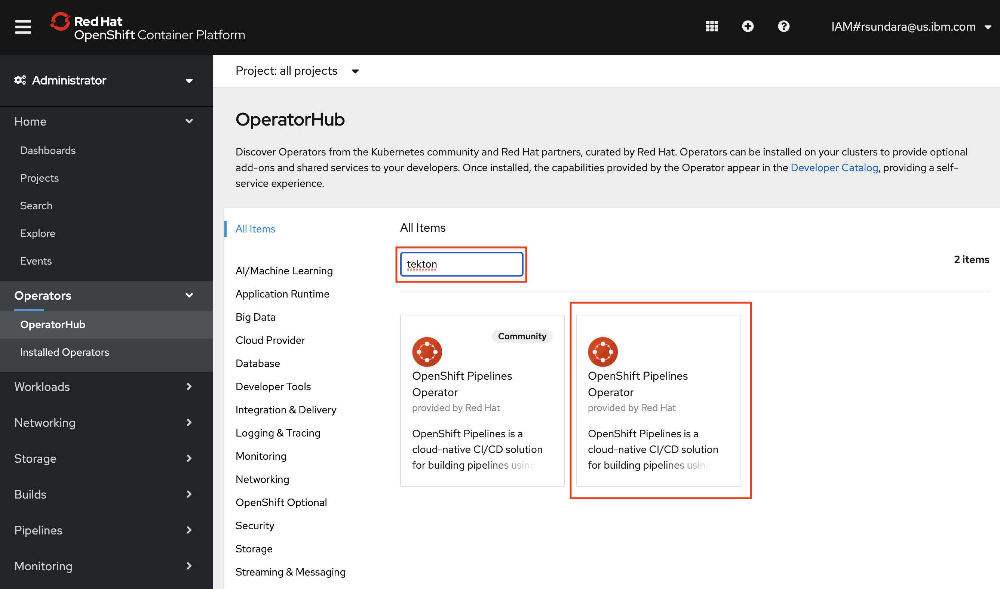
 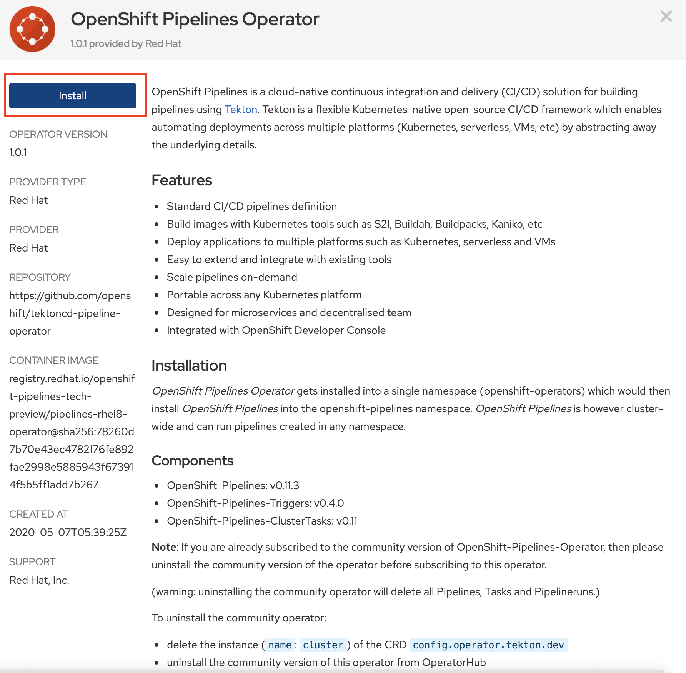
 
The following page will be displayed, and you can click **Subscribe** to have the Tekton operator installed.
 
 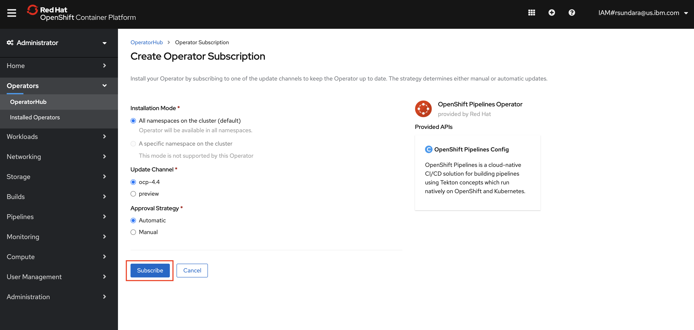
 
#### 1.2 Install Tekton dashboard

The link [https://github.com/tektoncd/dashboard](https://github.com/tektoncd/dashboard) can used as reference to install **Tekton dashboard Version 0.6.1.4**. It includes the section for installing Tekton dashboard on OpenShift. The related commands are as follows:
   
```
oc project openshift-pipelines
kubectl apply --filename https://github.com/tektoncd/dashboard/releases/download/v0.6.1.4/openshift-tekton-dashboard-release.yaml --validate=false
```

The tekton dashboard can be accessed using the following route: 

```
kubectl get route tekton-dashboard -n openshift-pipelines
```


### 2. Create Tekton resources

The script [createTektonResources.sh](./createTektonResources.sh) can be run to create the resources defined in the following manifests files. Also, the script [deleteTektonResources.sh](./deleteTektonResources.sh) can be run to delete the Tekton resources.

* [datapower-resources.yaml](./manifests/datapower-resources.yaml)
* [datapower-secrets-template.yaml](./manifests/datapower-secrets-template.yaml)
* [dp-demo-event-listener-route.yaml](./manifests/dp-demo-event-listener-route.yaml)
* [dp-demo-event-listener.yaml](./manifests/dp-demo-event-listener.yaml)
* [dp-demo-serviceAccount.yaml](./manifests/dp-demo-serviceAccount.yaml)
* [dp-demo-trigger-binding.yaml](./manifests/dp-demo-trigger-binding.yaml)
* [dp-demo-trigger-template.yaml](./manifests/dp-demo-trigger-template.yaml)
* [install-datapower-pipeline.yaml](./manifests/install-datapower-pipeline.yaml)
* [install-datapower-task.yaml](./manifests/install-datapower-task.yaml)
* [uninstall-datapower-pipeline.yaml](./manifests/uninstall-datapower-pipeline.yaml)
* [uninstall-datapower-task.yaml](./manifests/uninstall-datapower-task.yaml)

Note that the scripts are designed to create the Tekton resources in the project **datapower**

The contents of the script file [initConfig.sh](./initConfig.sh) needs to be updated to suit the environment.

```
#!/usr/bin/env bash

#
# The following section needs to be completed to match the environment 
#

# Credentials to access git repository
# API Key can be created using the link --> https://help.github.com/en/github/authenticating-to-github/creating-a-personal-access-token-for-the-command-line
GIT_USER_NAME=xxx
GIT_API_KEY_OR_PASSWORD=xxx

# Domain suffix 
# Run the following command to get the domain suffix
# ---> oc get dns cluster -o yaml | grep baseDomain: | awk -F' ' '{print $2 }'
OPENSHIFT_CLUSTER_DOMAIN_SUFFIX=xxx

#
# End of configuration
# 
```  

Once the script file [initConfig.sh](./initConfig.sh) is updated the script [createTektonResources.sh](./createTektonResources.sh) can be run to create Tekton resources.

Sample run is listed below:

```
$ ./createTektonResources.sh 
Already on project "datapower" on server "https://c100-e.us-south.containers.cloud.ibm.com:32508".

You can add applications to this project with the 'new-app' command. For example, try:

    oc new-app django-psql-example

to build a new example application in Python. Or use kubectl to deploy a simple Kubernetes application:

    kubectl create deployment hello-node --image=gcr.io/hello-minikube-zero-install/hello-node

secret/common-settings created
secret/git-secret created
pipelineresource.tekton.dev/cp4i-datapower-source created
task.tekton.dev/install-datapower created
pipeline.tekton.dev/install-datapower created
task.tekton.dev/uninstall-datapower created
pipeline.tekton.dev/uninstall-datapower created
serviceaccount/dp-demo created
role.rbac.authorization.k8s.io/dp-demo created
rolebinding.rbac.authorization.k8s.io/dp-demo created
rolebindings.rbac.authorization.k8s.io/dp-demo-edit created
triggertemplate.triggers.tekton.dev/dp-demo-trigger-template created
triggerbinding.triggers.tekton.dev/dp-demo-trigger-binding created
eventlistener.triggers.tekton.dev/dp-demo created
route.route.openshift.io/el-dp-demo created
```

The following Tekton resources are created using the scripts.

#### 2.1 Tekton Pipelines

 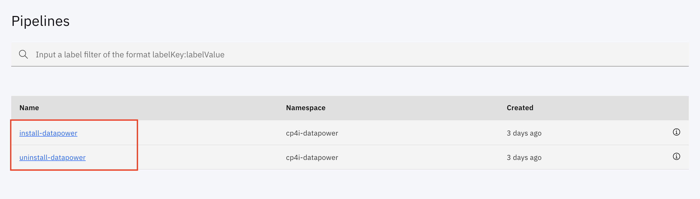
 
#### 2.2 Tekton Pipeline Resources 

 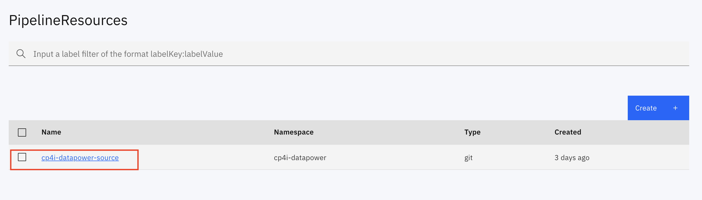

#### 2.3 Tekton Tasks
 
 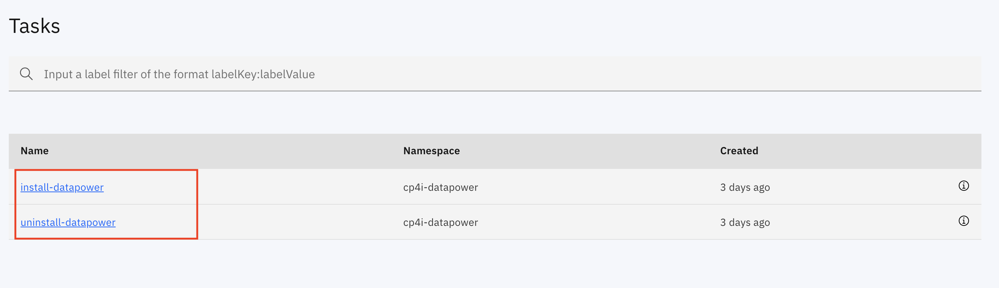

#### 2.4 Tekton Event Listeners
 
 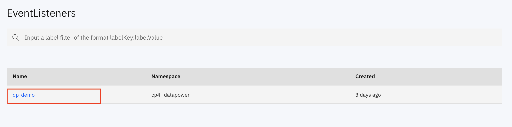

#### 2.5 Tekton Trigger Bindings
 
 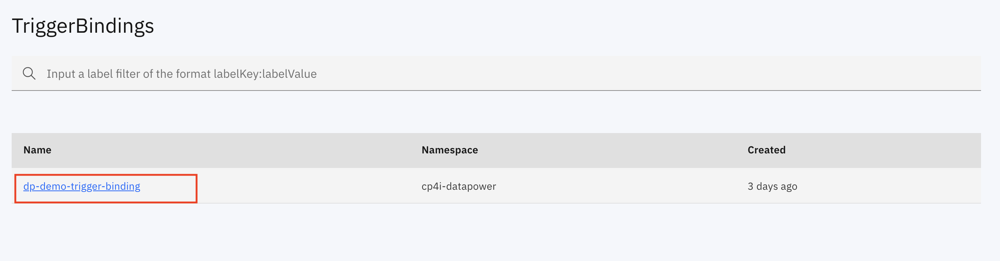

#### 2.6 Tekton Trigger Templates
 
 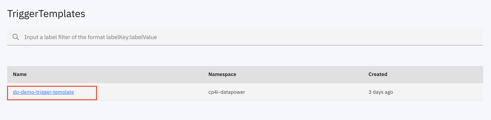
 

 
### 3. Run OpenShift Pipelines

Pipelines can be run to execute the tasks that set up the environment. When the pipelines are run it is required to run using the service account **dp-demo**.

#### 3.1 Pipeline for installing a DataPowerService instance

The parameters for running the pipeline to install a DataPowerService instance is listed below:

* **source** - Source having the scripts to perform the deploy tasks. It is set to **cp4i-datapower-source**.
* **dpconfig** - Specify the DataPower configuration to be used for installing the service. It is set to **dp-demo**.
* **production** - Specifies if the deployment is production-like with High Availability enabled. It is set to **false**.
* **env**  - Specifies the environment used for running pipeline. The value is used in computing the DataPowerService name. By default it is set to **dev**.
* **ServiceAccount** - Specfies the Service Account to run the pipeline. It is set to **dp-demo**.

 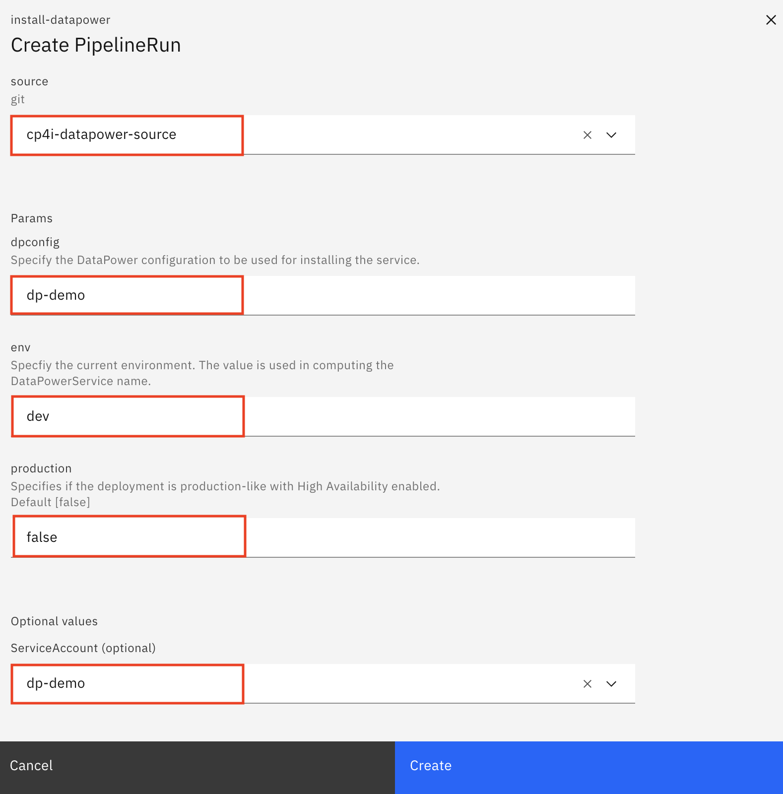
 
The PipelineRun having the results is listed below.

 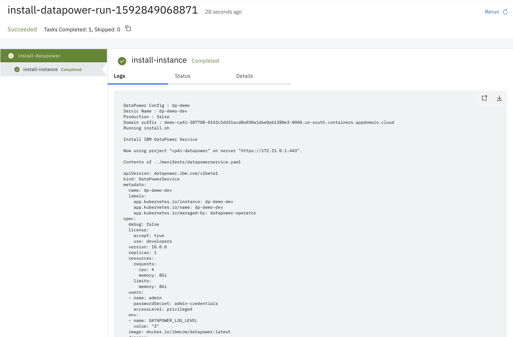
 
The following command can be run to retrieve the route for the demo service: 

```
oc get routes -n datapower | grep dp-demo | awk -F' ' '{print $2 }'
```
 
The demo service can be verified by accessing route for the target port **6443** using the link **[https://dp-demo.OPENSHIFT_CLUSTER_DOMAIN_SUFFIX:6443/demo.html](https://dp-demo.OPENSHIFT_CLUSTER_DOMAIN_SUFFIX:6443/demo.html)**

 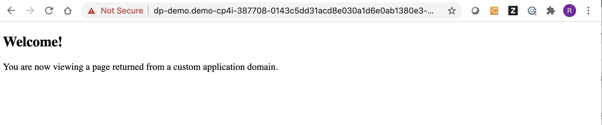

 
#### 3.2 Pipeline for uninstalling a DataPowerService instance

The parameters for running the pipeline to uninstall a DataPowerService instance is listed below:

* **source** - Source having the scripts to perform the deploy tasks. It is set to **cp4i-datapower-source**.
* **dpconfig** - Specify the DataPower configuration to be used for installing the service. It is set to **dp-demo**.
* **env**  - Specifies the environment used for running pipeline. The value is used in computing the DataPowerService name. By default it is set to **dev**.
* **ServiceAccount** - Specfies the Service Account to run the pipeline. It is set to **dp-demo**.

 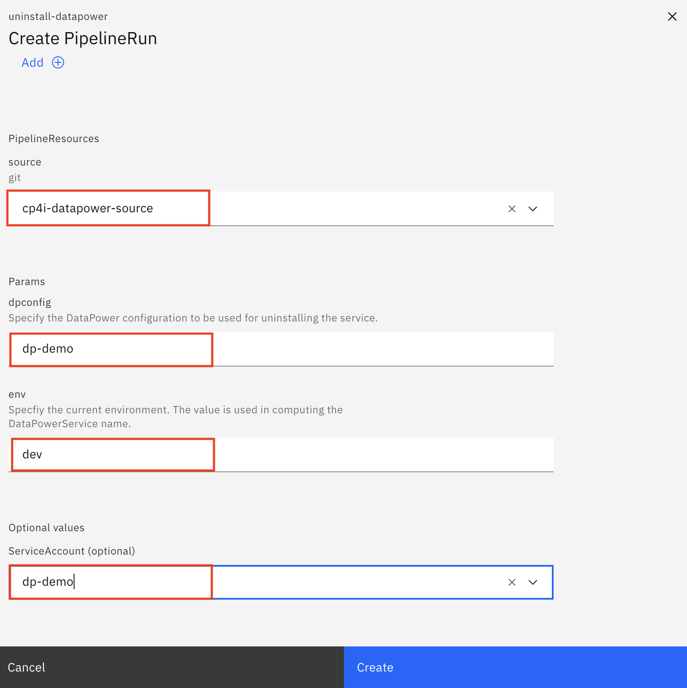
 
The PipelineRun having the results is listed below.

 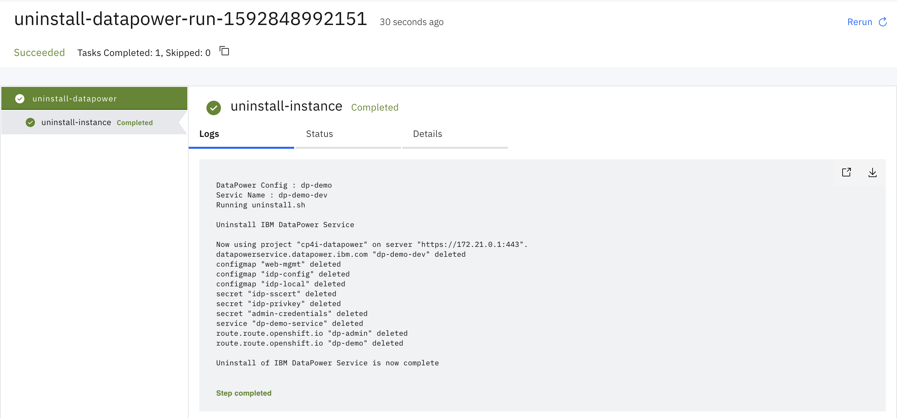


### 4. Enable Webhooks to trigger Pipeline Run. 

#### 4.1 Set up the GitHub pull request webhook

The following steps can be followed to enable the pull request webhook in GitHub.

**Step 1.** Open your fork of the **cp4i-datapower** repository in GitHub and navigate to the Webhooks menu. Then click the **Add webhook** button.

 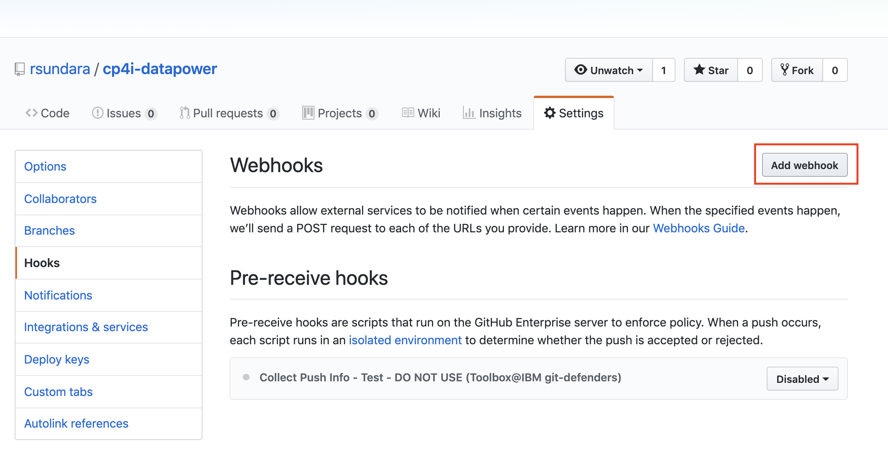
 
**Step 2.** Specify the settings for your new webhook (the images below provide a visual on how to do so):

* Set the Payload URL to the EventListener Route. It can be retrieved by running the following command: 
```
oc get route el-dp-demo --template='http://{{.spec.host}}'
```
* Set the Content type to **application/json**.
* Leave Secret blank
* Select **Let me select individual events**.
* Check **Pull requests** (there are a few pull request events, but only check the one that just says **Pull requests**).
* Uncheck **Pushes**. 

 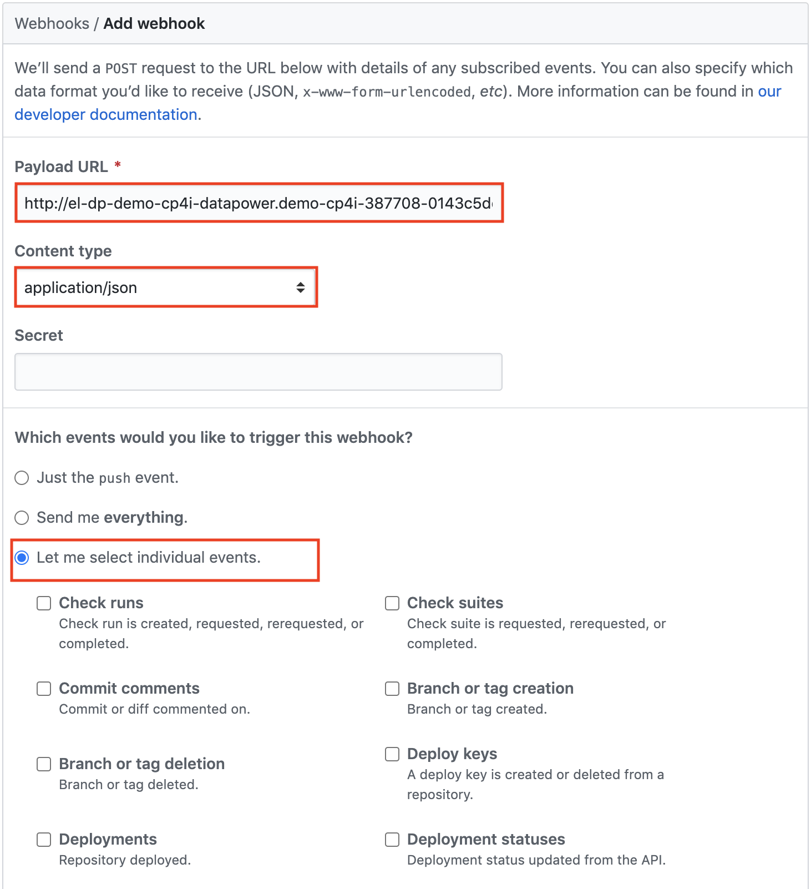
 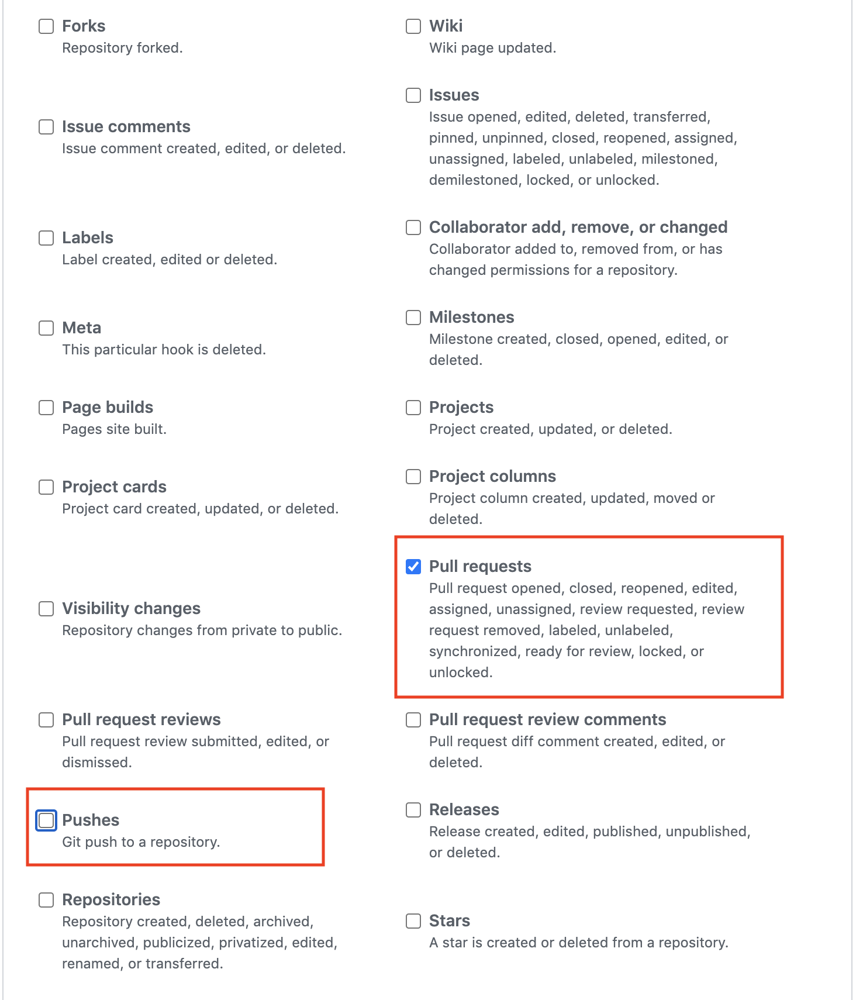
 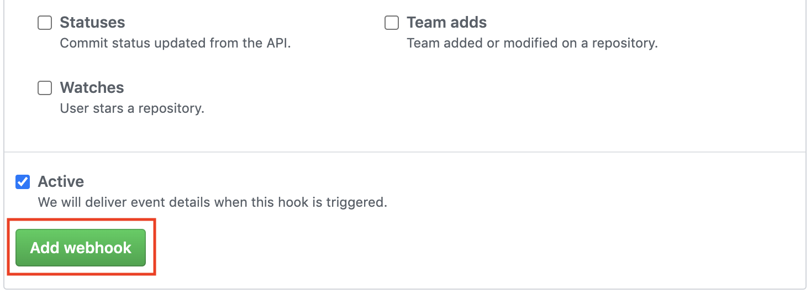
 
**Step 3.**  Now click the **Add webhook** button.

**Step 4.**  Verify that there is a green checkmark next to your webhook. This indicates that the **EventListener** sink Pod is receiving events from the webhook.

 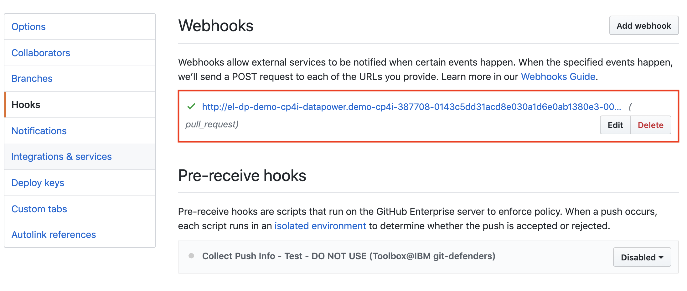

#### 4.2 Create a pull request to test the trigger
 
**Step 1.** Update the file [~/datapower-services/dp-demo/drouter/local/IDP/demo.html](../datapower-services/dp-demo/drouter/local/IDP/demo.html) to include the text **V2.0** at thee end as follows:

```
 ...
 ...
 <P>You are now viewing a page returned from a custom application domain. V2.0
 ...
 ...
```

**Step 2.** Save the demo.html file, checkout a new branch, commit your change, and push it to GitHub:

 Checkout new branch "dp-demo"
``` 
 git checkout -b dp-demo
 # Commit changes
 git add .
 git commit -m "DP Demo"
 # Push to GitHub
 git push origin dp-demo
```

**Step 3.** Open GitHub in your web browser and create a pull request for your new branch **dp-demo**.

Your new pull request will kick off the PipelineRun to build and deploy your branch **dp-demo**.

**Step 4.** When the PipelineRun completes, verify that your changes have been deployed by accessing the Demo service. 

The following command can be run to retrieve the route for the demo service: 

```
oc get routes -n datapower | grep dp-demo | awk -F' ' '{print $2 }'
```
 
The demo service can be verified by accessing route for the target port **6443** using the link **[https://dp-demo.OPENSHIFT_CLUSTER_DOMAIN_SUFFIX:6443/demo.html](https://dp-demo.OPENSHIFT_CLUSTER_DOMAIN_SUFFIX:6443/demo.html)**

 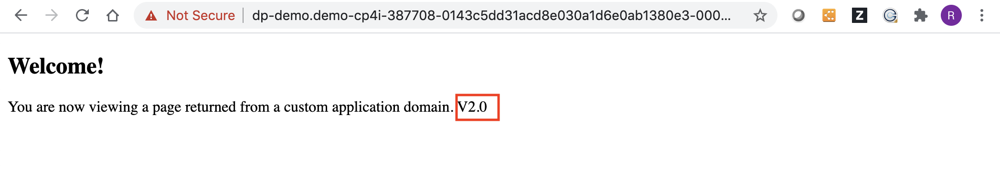


